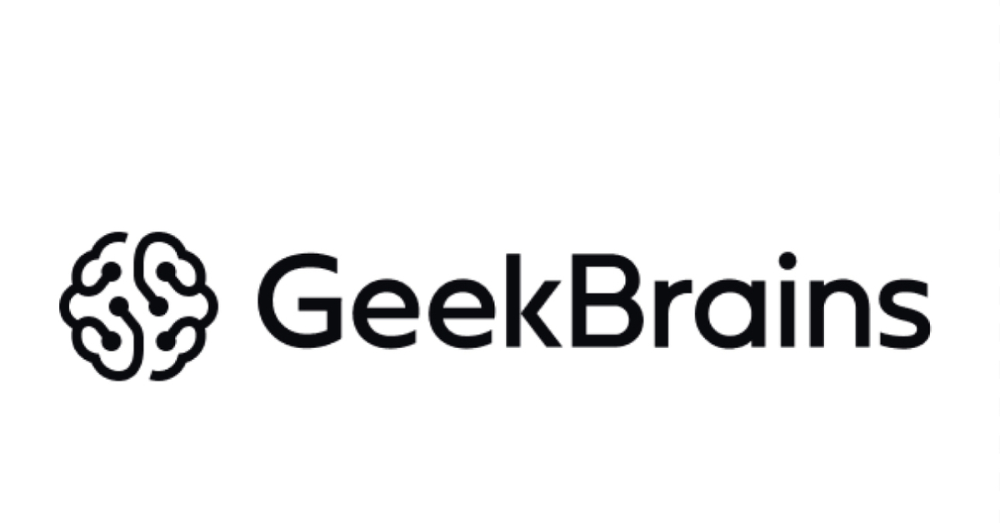

<p align="center">
      <br/>
     <H2 align="center">Команда Ikanam 1218</H2> 
    <H2 align="center">Кейс "Интеллектуальный анализатор обратной связи студентов 🙋‍♂"</H2> 
</p>

## Наша команда 
- Сиворакша Тимофей -  `ML-techlead`
- Уколов Степан -  `ML-engineer`
- Алиев Элвин -  `Designer`
- Валерий Ходжаев -  `Developer`
- Роман Федосеев -  `Data analyst`


## Наше решение кейса


1. __Тг бот__ 💬
2. __Модель для предиктов__ 🛠️
3. __Дэшборд с результатами__ 📈

Summary:

Сервис для детализированного анализа и категоризации обратной связи от студентов после вебинаров.

## [Тг бот](./telegram_bot) 💬

Для написания чат-бота были использованы библиотеки `telebot` и `SQLite3`. При помощи библиотеки telebot прописываем функционал бота: команда start, инициализация бота, приветственное сообщение, sendall — команда рассылки пользователям с просьбой оценить свою готовность дать ответы на несколько вопросов от 1 до 10.

При инициализации команды start пользователям в рабочей директории создается файл с базой данных `SQLite3`, в который добавляется id-шник пользователя, написавший боту впервые.Далее, когда администратор нажимает команду sendall, всем пользователям, которые есть в базе данных, отправляется сообщение рассылки.
После того, как пользователь даст свою оценку готовности (если она > 5), бот последовательно задает пользователю 5 вопросов. Ответы пользователя сохраняются в список, далее создается таблица в базе данных с ответами пользователей, в которой содержится id пользователя, время обратной связи, 5 столбцов с ответами на соответствующие вопросы. Ответы пользователя, время фидбека и его id добавляются в таблицу.

## [Модели и подходы](./models) 🛠️

1. __Генерация данных__
   
    С попощью `ChatGPT` и `saiga_mistral` мы сгенерировали > 1000 новых строк, немного компенсируя изначальный дисбаланс классов. Идея в том, чтобы обучаться на сгенерированном датасете и проверяться на выданном нам трэйне
   
2. __Подбор модели__

   __Baseline__
   ```
   TF-IDF + log reg 
   ```
   Для всех трёх целевых переменных
   Метрика F1 📊: 0.7677

   __Модель__
   ```
   ruRobertaModel + Catboost
   ```
   Для всех трёх целевых переменных
   Метрика F1 📊: 0.6886

   __Итоговая модель__
   ```
   TF-IDF + ruRobertaModel + Catboost 
   ```
   is_positive - Catboost
   is_relevant - TF-IDF + log reg
   objective - TF-IDF + log reg
   Метрика F1 📊: 0.8637

 
4. __Что в итоге получили__

    После различных тестов и исследований решили оставить более простую модель, из-за более хороших результатов

## [Дэшборд с результатами](https://github.com/Y1OV/dashboard/tree/main) 📈

[Дэшборд](https://dashboard-2qpmhdds7e2ccdnvkb5b6v.streamlit.app)

С помощью библиотеки `streamlit` было создано веб-приложение. Мы написали Python-скрипт, выгружающий результат действия нашей модели, в котором создаётся интерфейс для нашего приложения, используя функции Streamlit для создания виджетов (таких как ползунки, кнопки, поля для ввода и т. д.) и вывода результатов на экран.

В нашем веб-приложении можно увидеть различную инфо-грфаику для интересующей нас целевой переменной, то есть существует возможность выбора. Также можно скачать отчёт в excel-формате о релевантных фидбэках, чтобы увидеть, какую именно полезную информацию пишут студенты после вебинаров. Это сделано для возможности опираться только на информативные отзывы и сразу реагировать.
